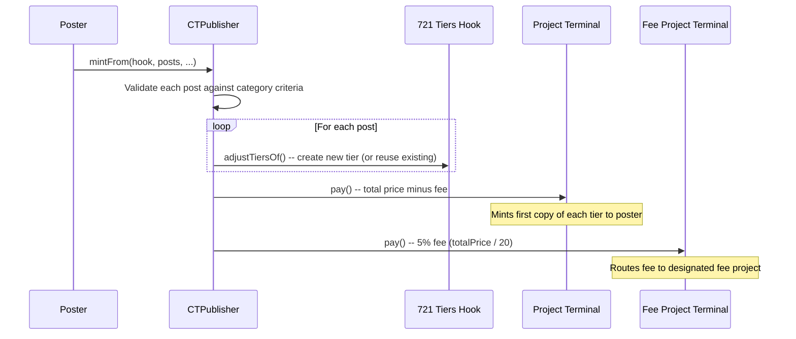

# Croptop Core

Permissioned NFT publishing for Juicebox projects -- anyone can post content as NFT tiers to a project's 721 hook, provided the posts meet criteria set by the project owner. A 5% fee is routed to a designated fee project on each mint.

[Docs](https://docs.juicebox.money) | [Discord](https://discord.gg/juicebox) | [Croptop](https://croptop.eth.limo)

**Supported Chains:** Ethereum, Optimism, Base, Arbitrum (mainnets) and Ethereum Sepolia, Optimism Sepolia, Base Sepolia, Arbitrum Sepolia (testnets). See `script/Deploy.s.sol` for the Sphinx deployment configuration.

## Conceptual Overview

Croptop turns any Juicebox project with a 721 tiers hook into a permissioned content marketplace. Project owners define posting criteria -- minimum price, supply bounds, address allowlists -- and anyone who meets those criteria can publish new NFT tiers on the project. The poster's content becomes a mintable NFT tier, and the first copy is minted to them automatically.

### How It Works

```
1. Project owner configures posting criteria per category
   → configurePostingCriteriaFor(allowedPosts)
   → Sets min price, supply bounds, max split %, address allowlist
   |
2. Anyone posts content that meets the criteria
   → mintFrom(hook, posts, nftBeneficiary, feeBeneficiary, ...)
   → Validates each post against category rules
   → Creates new 721 tiers on the hook (or reuses existing ones)
   → Mints first copy of each tier to the poster
   |
3. Payment routing
   → 5% fee (totalPrice / FEE_DIVISOR) sent to fee project
   → Remainder paid into the project's primary terminal
   |
4. Anyone can mint additional copies
   → Standard 721 tier minting via the project's hook
```



### Fee Structure

Every `mintFrom` call collects a 5% fee on the total tier price. The fee is calculated as `totalPrice / FEE_DIVISOR` where `FEE_DIVISOR = 20`. The fee is paid to the primary ETH terminal of a designated fee project (`FEE_PROJECT_ID`, set at deployment). The remainder goes to the target project's primary terminal as a normal payment.

- If the project being posted to **is** the fee project, no fee is collected (avoids circular payments).
- Integer division truncates, so the fee loses up to 19 wei of dust per mint.
- Any ETH remaining in the contract after the main payment (including force-sent ETH) is forwarded to the fee project terminal.

### One-Click Deployment

`CTDeployer` creates a complete Juicebox project + 721 hook + posting criteria in a single transaction. It also:
- Acts as a data hook proxy, forwarding pay/cash-out calls to the underlying 721 hook
- Grants fee-free cash outs to cross-chain suckers
- Optionally deploys suckers for omnichain support

### Burn-Lock Ownership

`CTProjectOwner` provides an ownership burn-lock pattern. Transferring a project's NFT to this contract permanently locks ownership while granting `CTPublisher` tier-adjustment permissions -- making the project's configuration immutable except through Croptop posts.

## Architecture

| Contract | Description |
|----------|-------------|
| `CTPublisher` | Core publishing engine. Validates posts against owner-configured allowances (min price, supply bounds, address allowlists, max split percent), creates new 721 tiers on the hook, mints the first copy to the poster, and routes a 5% fee to a designated fee project. Inherits `JBPermissioned` and `ERC2771Context`. |
| `CTDeployer` | One-click project factory. Deploys a Juicebox project with a 721 tiers hook pre-wired, configures posting criteria via `CTPublisher`, optionally deploys cross-chain suckers, and acts as an `IJBRulesetDataHook` proxy that forwards pay/cash-out calls to the underlying hook while granting fee-free cash outs to suckers. |
| `CTProjectOwner` | Burn-lock ownership helper. Receives a project's ERC-721 ownership token and automatically grants `CTPublisher` the `ADJUST_721_TIERS` permission, effectively making the project's tier configuration immutable except through Croptop posts. |

### Structs

| Struct | Purpose |
|--------|---------|
| `CTAllowedPost` | Full posting criteria: hook address, category, price/supply bounds, max split percent, and address allowlist. |
| `CTDeployerAllowedPost` | Same as `CTAllowedPost` but without the hook address (inferred during deployment). |
| `CTPost` | A post to publish: encoded IPFS URI, total supply, price, category, split percent, and splits. |
| `CTProjectConfig` | Project deployment configuration: terminals, metadata URIs, allowed posts, collection name/symbol, and deterministic salt. |
| `CTSuckerDeploymentConfig` | Cross-chain sucker deployment: deployer configurations and deterministic salt. |

### Interfaces

| Interface | Description |
|-----------|-------------|
| `ICTPublisher` | Publishing engine: `mintFrom`, `configurePostingCriteriaFor`, `allowanceFor`, `tiersFor`, plus events. |
| `ICTDeployer` | Factory: `deployProjectFor`, `claimCollectionOwnershipOf`, `deploySuckersFor`. |
| `ICTProjectOwner` | Burn-lock: `onERC721Received` (IERC721Receiver). |

## Install

```bash
npm install @croptop/core-v6
```

If using Forge directly:

```bash
forge install
```

## Develop

| Command | Description |
|---------|-------------|
| `forge build` | Compile contracts |
| `forge test` | Run all tests (4 test files covering publishing, attacks, fork integration, metadata) |
| `forge test -vvv` | Run tests with full trace |

## Repository Layout

```
src/
  CTPublisher.sol                        # Core publishing engine (~540 lines)
  CTDeployer.sol                         # Project factory + data hook proxy (~425 lines)
  CTProjectOwner.sol                     # Burn-lock ownership helper (~79 lines)
  interfaces/
    ICTPublisher.sol                     # Publisher interface + events
    ICTDeployer.sol                      # Factory interface
    ICTProjectOwner.sol                  # Burn-lock interface
  structs/
    CTAllowedPost.sol                    # Posting criteria with hook address
    CTDeployerAllowedPost.sol            # Posting criteria without hook (for deployment)
    CTPost.sol                           # Post data: IPFS URI, supply, price, category
    CTProjectConfig.sol                  # Full project deployment config
    CTSuckerDeploymentConfig.sol         # Cross-chain sucker config
test/
  CTPublisher.t.sol                      # Unit tests (~672 lines, ~22 cases)
  CroptopAttacks.t.sol                   # Security/adversarial tests (~440 lines, ~12 cases)
  Fork.t.sol                             # Mainnet fork integration tests
  Test_MetadataGeneration.t.sol          # JBMetadataResolver roundtrip tests
script/
  Deploy.s.sol                           # Sphinx multi-chain deployment
  ConfigureFeeProject.s.sol              # Fee project configuration
  helpers/
    CroptopDeploymentLib.sol             # Deployment artifact reader
```

## Permissions

| Permission | Required For |
|------------|-------------|
| `ADJUST_721_TIERS` | `configurePostingCriteriaFor` -- set posting criteria on a hook (from hook owner) |
| `DEPLOY_SUCKERS` | `deploySuckersFor` -- deploy cross-chain suckers for an existing project |

`CTDeployer` grants the following to the project owner during deployment:
- `ADJUST_721_TIERS` -- modify tiers directly
- `SET_721_METADATA` -- update collection metadata
- `MINT_721` -- mint NFTs directly
- `SET_721_DISCOUNT_PERCENT` -- adjust discount rates

## Risks

- **Sucker registry compromise:** `CTDeployer.beforeCashOutRecordedWith` checks `SUCKER_REGISTRY.isSuckerOf` to grant fee-free cash outs. If the sucker registry is compromised, any address could cash out without tax.
- **Fee skipping:** When `projectId == FEE_PROJECT_ID`, no fee is collected. This is intentional but means the fee project itself never pays Croptop fees.
- **Allowlist scaling:** `_isAllowed()` uses linear scan over the address allowlist. Large allowlists (100+ addresses) increase gas costs proportionally.
- **Tier reuse via IPFS URI:** If the same encoded IPFS URI has already been minted, the existing tier is reused rather than creating a new one. This prevents duplicate content but means a poster cannot create a second tier with the same content.
- **Exact payment edge case:** `mintFrom` sends the remaining contract balance as the fee payment after the main payment. If exactly the right amount is sent (no remainder), the fee transfer is skipped.
